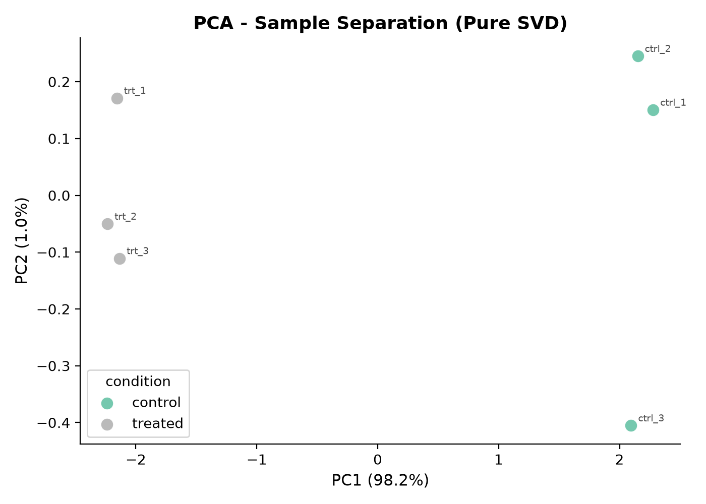
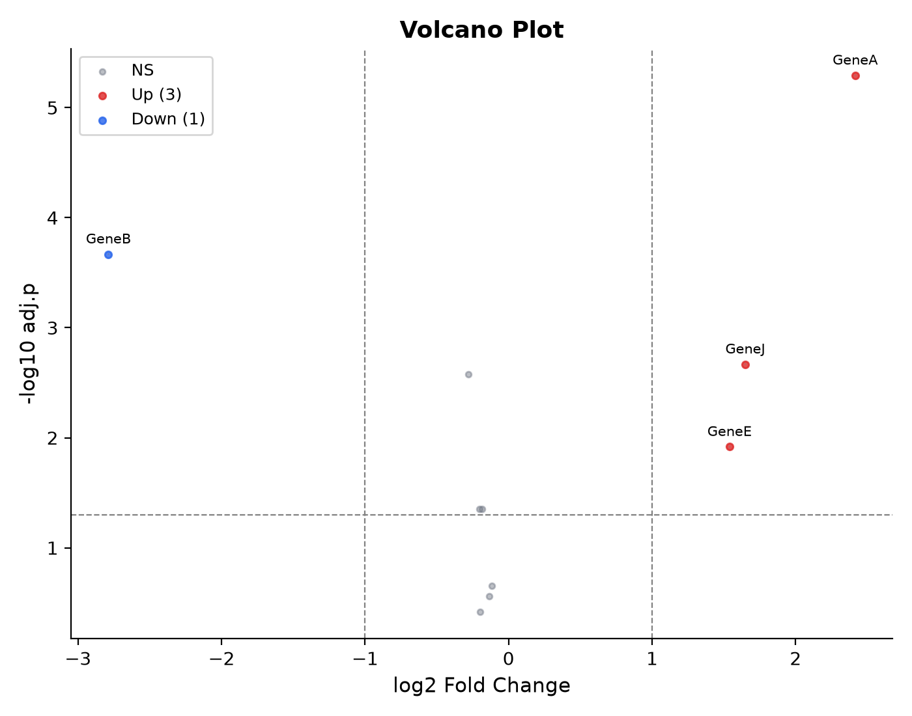
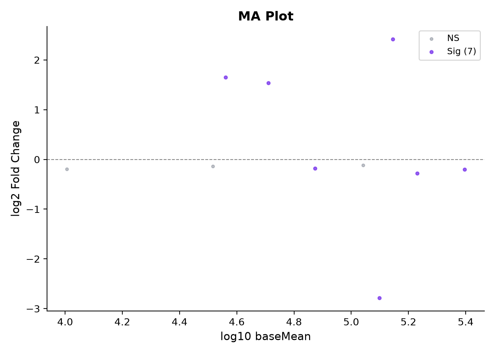
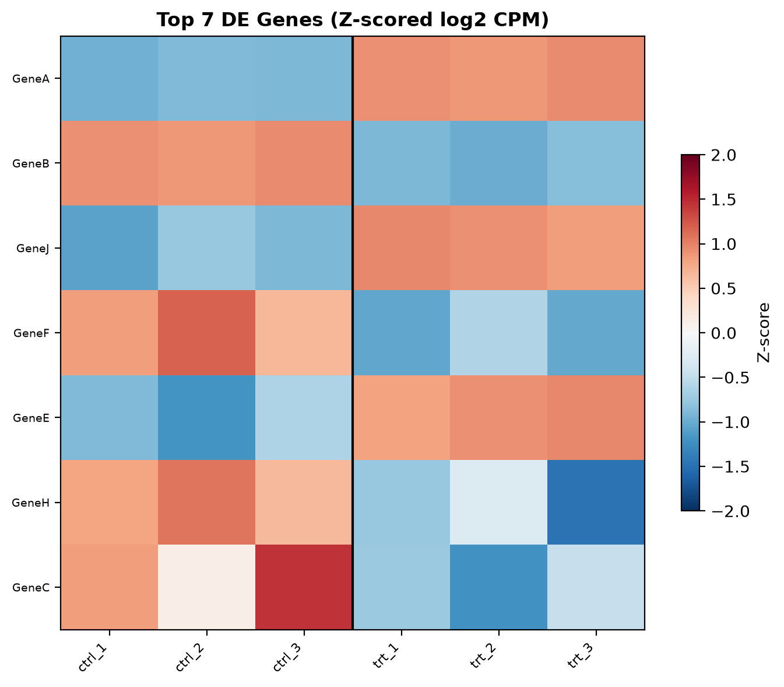

# Differential Expression Report (Ultra-Lean Pipeline)
**Generated**: 2026-08-31 11:29 UTC
**Samples**: 6 | **Genes pre-filter**: 10 | **Genes post-filter**: 10
**Formula**: `~ batch + condition` | **Contrast**: `condition,treated,control`
**Backend**: `Welch log2(CPM) + Pure NumPy SVD PCA` (Dependencies: `pandas`, `numpy`, `matplotlib`)
---
## 1. QC & PCA
QC table: `tables/qc_summary.csv`

---
## 2. Differential Expression
**Significant** (padj < 0.05 & |log2FC| >= 1.0): **4** (3 up, 1 down)
Full results: `tables/de_results.csv`
### Top 10 Genes
| Gene | log2FC | p-value | padj |
|------|-------:|--------:|-----:|
| `GeneA` | +2.415 | 5.101e-07 | 5.101e-06 |
| `GeneB` | -2.788 | 4.301e-05 | 2.151e-04 |
| `GeneJ` | +1.649 | 6.456e-04 | 2.152e-03 |
| `GeneF` | -0.282 | 1.054e-03 | 2.635e-03 |
| `GeneE` | +1.539 | 6.045e-03 | 1.209e-02 |
| `GeneH` | -0.202 | 2.927e-02 | 4.420e-02 |
| `GeneC` | -0.183 | 3.094e-02 | 4.420e-02 |
| `GeneD` | -0.118 | 1.761e-01 | 2.201e-01 |
| `GeneI` | -0.135 | 2.486e-01 | 2.763e-01 |
| `GeneG` | -0.197 | 3.813e-01 | 3.813e-01 |

---
## 3. Pathway Enrichment
_No enrichment results._

---
## 4. Reproducibility
`reproducibility/commands.sh` | `reproducibility/environment.yml` | `reproducibility/checksums.sha256`

> This pipeline is a research and educational tool — not for clinical diagnostic use.
