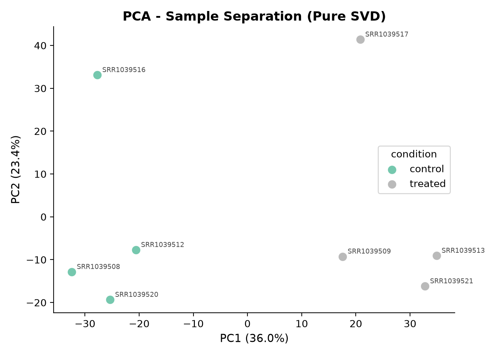
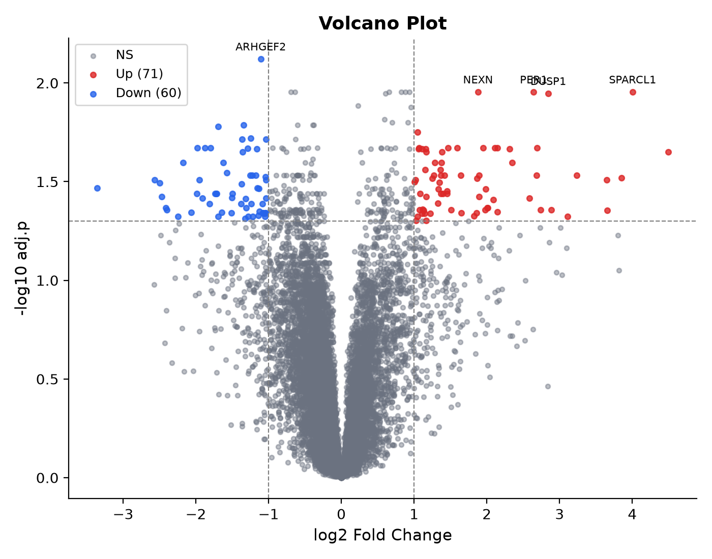
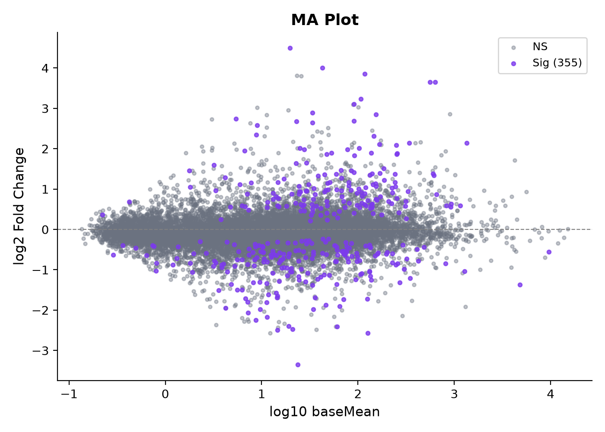
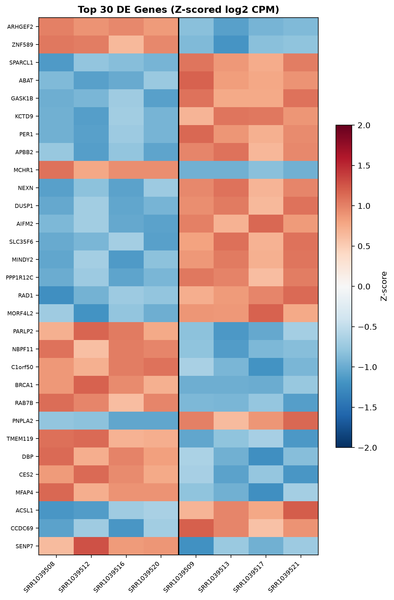
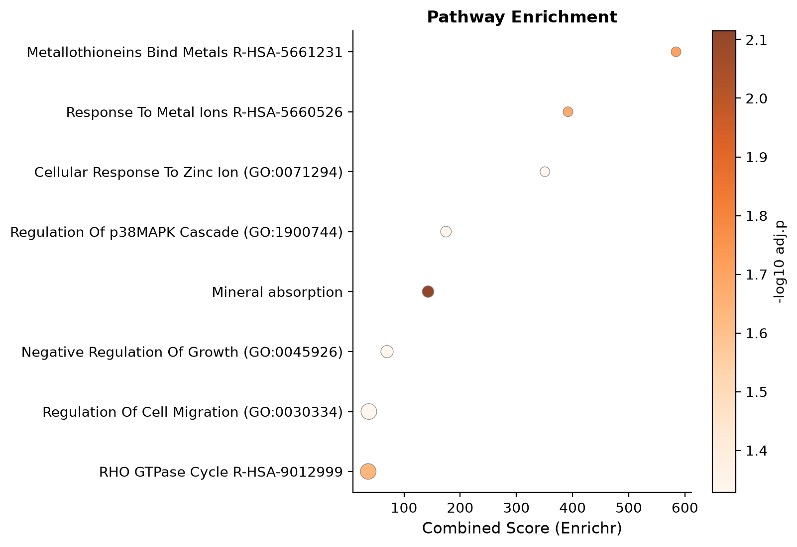

# Differential Expression Report (Ultra-Lean Pipeline)
**Generated**: 2026-08-31 11:35 UTC
**Samples**: 8 | **Genes pre-filter**: 35268 | **Genes post-filter**: 15202
**Formula**: `~ batch + condition` | **Contrast**: `condition,treated,control`
**Backend**: `Welch log2(CPM) + Pure NumPy SVD PCA` (Dependencies: `pandas`, `numpy`, `matplotlib`)
---
## 1. QC & PCA
QC table: `tables/qc_summary.csv`

---
## 2. Differential Expression
**Significant** (padj < 0.05 & |log2FC| >= 1.0): **131** (71 up, 60 down)
Full results: `tables/de_results.csv`
### Top 10 Genes
| Gene | log2FC | p-value | padj |
|------|-------:|--------:|-----:|
| `ARHGEF2` | -1.108 | 4.965e-07 | 7.548e-03 |
| `ZNF589` | -0.693 | 6.529e-06 | 1.109e-02 |
| `SPARCL1` | +4.003 | 2.153e-06 | 1.109e-02 |
| `ABAT` | +0.883 | 4.773e-06 | 1.109e-02 |
| `GASK1B` | +0.938 | 7.296e-06 | 1.109e-02 |
| `KCTD9` | +0.655 | 6.953e-06 | 1.109e-02 |
| `PER1` | +2.643 | 5.492e-06 | 1.109e-02 |
| `APBB2` | +0.825 | 6.221e-06 | 1.109e-02 |
| `MCHR1` | -0.634 | 5.622e-06 | 1.109e-02 |
| `NEXN` | +1.880 | 6.128e-06 | 1.109e-02 |

---
## 3. Pathway Enrichment
Results: `tables/enrichment_results.csv`

| Term | Library | adj.p | Score |
|------|---------|------:|------:|
| Metallothioneins Bind Metals R-HSA-5661231 | Reactome_2022 | 1.945e-02 | 584.2 |
| Response To Metal Ions R-HSA-5660526 | Reactome_2022 | 2.115e-02 | 391.9 |
| Cellular Response To Zinc Ion (GO:0071294) | GO_Biological_Process_2023 | 4.696e-02 | 350.8 |
| Regulation Of p38MAPK Cascade (GO:1900744) | GO_Biological_Process_2023 | 4.696e-02 | 174.7 |
| Mineral absorption | KEGG_2021_Human | 7.675e-03 | 142.9 |

---
## 4. Reproducibility
`reproducibility/commands.sh` | `reproducibility/environment.yml` | `reproducibility/checksums.sha256`

> This pipeline is a research and educational tool — not for clinical diagnostic use.
